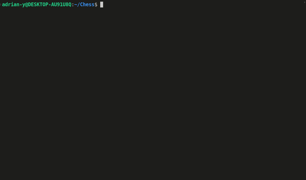

# CLI Ruby Chess Game

**To play the game visit [replit](https://replit.com/@adrian-y1/TOPChess#README.md)**

This is a command-line interface Chess game created with Ruby as the final project for [The Odin Project's Ruby course.](https://www.theodinproject.com/lessons/ruby-ruby-final-project)  

## Overview
Chess is a turn-based two-player strategy board game where players take turns moving their pieces with the ultimate goal of capturing their opponent's King via *checkmate* while also protecting their own. Chess has an abundant amount of rules that must be followed to play the game accordingly. For more details on rules of Chess please click [here](https://en.wikipedia.org/wiki/Chess).

This CLI Chess game was created with [Ruby 3.1](https://www.ruby-lang.org/en/) whereby players enter commands in the CLI to perform the actions required to play the game including but no limited to; move one's piece, saving a game, promotion and many more. Full list of current features is listed further down in the document.

Along with the game, [Rspec 3.11](https://rspec.info/) is used in order to create various tests for the game. The nature of the tests involves testing cirtical class methods with many different possible outcomes to ensure the game is error and bug free.

## How To Play
- Online
  - To play online visit the link at the top of this document or click [here](https://replit.com/@adrian-y1/TOPChess#README.md)
  - Press `Run` or enter `ruby lib/main.rb` in the terminal to start the game
- Local
  - To play locally, you must first install [Ruby](https://www.ruby-lang.org/en/)
  - After that, [clone](https://github.com/git-guides/git-clone) this [repository](https://github.com/adrian-y1/TOPChess)
  - Install dependencies such as the [colorize](https://github.com/fazibear/colorize) gem
  - To start the game, enter `ruby lib/main.rb` in the terminal
  - To run the tests you must first install [Rspec](https://rspec.info/)
  - After that, enter `rspec` to execute the tests
    - Alternatively you can enter `rspec spec/path/to/file` to execute tests for a specific file or folder

## Features
- Check
- Checkmate, Stalemate & Resignation (forfeit)
- Castling
- En Passant
- Promotion
- Save Game
- Load Saved Game
- Captured Pieces displayed
- Players notified when in *check*
- Illegal moves automatically removed

## Difficulties
During the implementation of this project i was faced with many difficulties that challenged my ability to the fullest. One of the most challenging problems was figuring out how to calculate the legal movements for each game piece. However, the Pawn piece/class was by far the most difficult one to create due to it's unique set of moves that are unlike any of the other pieces. 

Another hardship i faced with this project was keeping the implementation modular and clean. Due to this project being such a large program to write, it was crucial to structure and seperate large and important aspects of the game into classes/modules. As the program got gradually bigger, testing it got harder.

## Overcoming Difficulties
Thorough planning before and during implementation helped me overcome many of the challenges i faced throughout the project. Simulating board movements on a virtual chess board ([lichess](https://lichess.org/editor)) assisted me in breaking down and calculating the possible movements for each game piece by visualing them. The En Passant move for the Pawn was the most challenging one to create as i had never known or heard about it before. I used online resources such as the [chess](https://www.chess.com/terms/en-passant) website to help me understand the move and often asked [The Odin Project's discord](https://discord.gg/V75WSQG) community for assistance and feedback on my logical approaches and implementations to the problem.

To make sure i kept my program modular and clean to the best of my ability i seperated large features into their own class/methods. To ensure that each method was doing one thing at a time, i broke down my larger methods into smaller problems whereby creating methods that each focus on solving one problem at a time and combining all of them at the end. To assist me with this i used [RuboCop](https://github.com/rubocop/rubocop) and [Ruby docs](https://rubyapi.org/) to find shorthand notations for objects/methods.

The larger my program got, the harder testing it became. Keeping my code modular and clean played a crucial part in making testing it easier. Creating dependency injections for objects also played a great role.

## Future Checklist
In the future i would like to further improve this project and create various new features. Such features include:
  - Dead Position
  - Draw By Agreement
  - Computer Player (AI)
  - Fifty-move rule
  - Board visual indication of possible moves of the chosen piece
  - Improve Styling

## Conclusion
To conclude, although this project was extremely challenging, most likely the most difficult one i have implemented to date, it was also fun as i thoroughly enjoyed the journey. I gained tremendous amount of knowledge and skill working with [Ruby](https://www.ruby-lang.org/en/) and due to the great amount of critical thinking required to solve majority of the problems that the game presented and required, i enhanced my problem solving skills.

